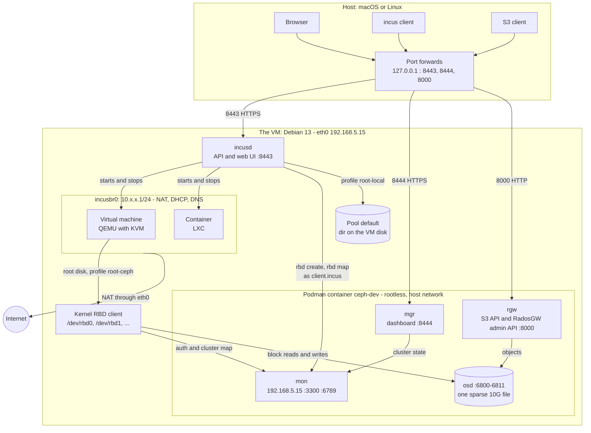

# Architecture

How the services are built, which networks they use, and how traffic flows
between them. The diagram shows the Lima VM. On a Debian host everything
inside the box is the same; there are no port forwards, and the three
services are reached on the host's own addresses.

## Overview



## Networks

| Network | Address | What is on it |
|---|---|---|
| Host loopback | `127.0.0.1` | The three forwarded ports. Nothing listens on other host addresses. |
| Lima user network | VM at `192.168.5.15` | The VM's `eth0`, with outbound internet through the host. The Ceph daemons bind here. |
| `incusbr0` | a random `10.x.x.1/24`, chosen when the bridge is created | Incus instances. Incus runs DHCP and DNS on the bridge and does NAT out through `eth0`. |

The Ceph container has no network of its own. It runs with `--network host`,
so its daemons listen on the VM's own addresses. That is what lets the VM's
kernel reach the monitor: with a container network and published ports the
monitor would advertise an address that only exists inside the container.

## Ports

| Port | Listens on | Service | Reachable from the host |
|---|---|---|---|
| 8443 | all VM addresses | Incus API and web UI (`/ui/`) | yes, `https://127.0.0.1:8443` |
| 8444 | all VM addresses | Ceph dashboard | yes, `https://127.0.0.1:8444` |
| 8000 | all VM addresses | S3 API of the Ceph object gateway (RadosGW), and the RadosGW admin API under `/admin` | yes, `http://127.0.0.1:8000` |
| 3300, 6789 | `192.168.5.15` | Ceph monitor, protocol v2 and v1 | no |
| 6800-6811 | `192.168.5.15` | Ceph OSD, manager and metadata server | no |
| 53, 67 | `incusbr0` | DNS and DHCP for instances | no |

The forwards are in `portForwards` in `lima.yaml`. The last rule there ignores
every other port, so nothing else in the VM appears on the host.

## Flows

**A request from the host.** A browser, the `incus` client or an S3 client
connects to `127.0.0.1` on the host. Lima carries it into the VM on the same
port number.

**An instance on Ceph.** With the profile `root-ceph`, `incusd` runs `rbd` as
`client.incus` to create the images in the Ceph pool `incus`, then maps them
with the kernel RBD client. A virtual machine gets two images: a small one
with its configuration, mounted in the VM, and a block image that QEMU uses as
the root disk.

```
id  pool   image                       device
0   incus  virtual-machine_v1.block    /dev/rbd0    root disk, given to QEMU
1   incus  virtual-machine_v1          /dev/rbd1    configuration, mounted
```

**The kernel and Ceph.** The kernel RBD client first talks to the monitor on
port 3300 or 6789 to authenticate and fetch the cluster map, then reads and
writes blocks directly on the OSD.

**An instance on local storage.** With the profile `root-local` the root disk
is a directory in the pool `default`, on the VM's own disk. Ceph is not
involved.

**An S3 request.** The object gateway stores objects in the same OSD, in its
own pools (`default.rgw.*`).

**Traffic from an instance.** Instances get an address on `incusbr0`. Incus
does NAT to `eth0`, and the host takes it from there to the internet.

## Storage

| Incus pool | Driver | Backed by | Profile that uses it |
|---|---|---|---|
| `default` | `dir` | `/var/lib/incus/storage-pools/default` | `root-local` |
| `ceph` | `ceph` | the Ceph pool `incus`, as RBD images | `root-ceph` |

The profile `default` holds the network card only. An instance takes `default`
plus one of the two root disk profiles, so the pool is chosen per instance.

The Ceph cluster has one OSD, a sparse file of 10 GiB inside the container
(`OSD_SIZE`). All pools have one replica. The cluster lives in the container's
own storage, so it survives a restart of the VM and is lost when the container
is removed.

## Start order

After a start of the VM, `incusd` is up before Ceph. Incus marks the pool
`ceph` as `UNAVAILABLE`, tries again every minute, and finds it once the
monitor answers. The end-to-end test waits for that.
